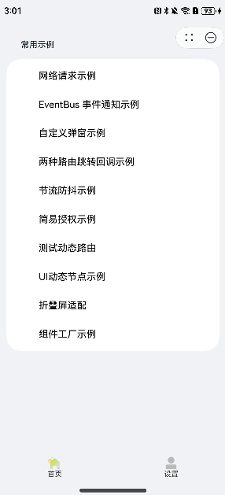
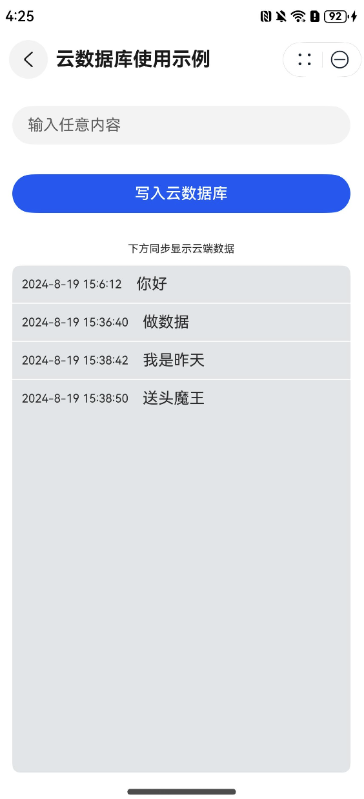

## HarmonyOS NEXT 元服务设计示例

基于 API11，开发的程序示例，适用于 NEXT 及以上版本运行。

项目包含如下：

+ 静态库+动态包+多模块设计
+ 状态管理
+ 统一路由管理（router+navPathStack）
+ 网络请求、Loading、Toast、数据持久化 等工具库封装
+ 自定义组件、自定义弹窗（解耦）
+ EventBus 事件通知
+ 扩展修饰器，实现 节流、防抖、权限申请
+ 动态路由 （navPathStack + 动态import + WrappedBuilder）
+ UI动态节点操作 (BuilderNode + NodeController)
+ 折叠屏适配示例
+ 组件工厂示例
+ 组件动态属性设置示例
+ 云函数、云数据库使用示例
+ 华为账号服务示例（快速登陆、快速验证手机号）

项目结构描述

#### 基础库

| 模块名称                | 描述                  | 备注                                                                                                                                                                               |
|---------------------|---------------------|----------------------------------------------------------------------------------------------------------------------------------------------------------------------------------|
| **fast_util**       | 工具类                 | FastLog（日志打印）<br/>EventBus（消息通知）<br/>FastRouter（基于Route封装的路由管理）<br/> FastNavRouter（动态路由）<br/>ThrottleTool (节流、防抖) <br/>FastPermission (修饰器实现权限申请) <br/>PreferencesUtil (数据持久化封装) |
| **fast_ui**         | 提供 UI 封装、样式、toast 等 | CommonText（统一文本）<br/>CommonButton（统一按键）<br/> FastToast <br/> FastLoading                                                                                                         |
| **global_constant** | 记录全局常量配置            | PagePathConstants (路由路径管理)                                                                                                                                                       |

#### 业务库
| 模块名称                 | 描述         | 备注 |
|----------------------|------------|--|
| **feature_home**     | 主要存放代码示例   | 静态包（har） |
| **feature_setting**  | 存放华为账号服务示例 | 静态包（har） |
| **feature_hsp_page** | 存放动态包交互示例  | 动态包（hsp/share） |

#### 工程目录
```ts
├──entry                                        // ets代码区
│  └──src/main/ets 
│       ├──entryability  
│       │  ├──FoldStatusObserver.ets             // 折叠屏幕变化监听
│       │  └──EntryAbility.ets         
│       ├──pages  
│       │  └──MainPage.ets                       // 首页
├──business                                      // 放置静态包的文件夹（业务模块）
│  ├──feature_home                               // 放置首页Tab里的一些示例页面                 
│  │   └──/src/main/ets/pages      
│  │      ├──HomePage.ets                         //首页的第一个Tab                     
│  │      ├──BuilderNodeExample.ets               //动态节点操作示例          
│  │      ├──CustomDialogExample.ets              //自定义弹窗解耦
│  │      ├──EventBusExample.ets                  //消息通知
│  │      ├──HttpRequestExample.ets               //网络请求示例
│  │      ├──PermissionExample.ets                //使用注解请求权限
│  │      ├──RouterCallbackExample.ets            //使用 NavPathStack 与 Route 两种方式实现页面跳转及回调（HSP、HAR）
│  │      ├──FixFoldUiExample.ets                 //折叠屏适配示例
│  │      ├──ComponentFactoryExample.ets          //组件工厂示例
│  │      ├──AttributeModifierExample.ets         //组件动态属性设置示例
│  │      ├──CloudFuncExample.ets                 //云函数调用示例
│  │      ├──CloudDatabaseExample.ets             //云数据库使用示例（增删改查）
│  │      └──ThrottleExample.ets                  //使用注解防抖
│  ├──feature_setting   
│  │   └──/src/main/ets
│  │      ├──pages    
│  │      │   ├──SettingPages.ets                 //首页的第二个Tab（包含了华为账号服务示例）
│  │      │   └──TestDynamicNavPage.ets           //测试动态路由示例
│  │      ├──widget  
│  │      │   ├──AccountQuickLoginButton.ets      //华为账号快速登陆按钮
│  │      │   └──QuickVerifyPhoneButton.ets       //快速验证手机号按钮
│  │      └──utils  
│  │          └──LoginUtils.ets                   //Account-Kit 获取 UnionID 能力封装 
├──features                                       //放置动态包的文件夹
│  ├──feature_has_page  
│  │   └──/src/main/ets/pages  
│  │      ├──TestHspNavPathPage.ets               //测试 NavPath 跳转 HSP 内页面
│  │      └──TestHspRouterPage.ets                //测试 Route 跳转 HSP 内页面
├──base  
│  ├──fast_ui                                     //封装公共UI
│  │   ├──/src/main/ets/compnents  
│  │   │   ├──FoldStatusContainer.ets             // 折叠屏变化响应组件封装
│  │   │   ├──FastLoading.ets                     // loading工具
│  │   │   └──FastToast.ets                       // toast工具
│  │   └──/src/main/ets/styles                    // 公共样式
│  ├──fast_util                                   // 通用工具
│  │   ├──/src/main/ets 
│  │      ├──EventBus.ets                         // 消息通知+监听                     
│  │      ├──FastLog.ets                          // 日志打印
│  │      ├──FastNavRouter.ets                    // 用于动态路由
│  │      ├──FastPermission.ets                   // 请求权限注解器
│  │      ├──FastRouter.ets                       // 基于 router 库封装，为了实现页面回调
│  │      ├──FastTool.ets                
│  │      ├──PreferencesUtil.ets                  // 数据持久化工具
│  │      └──ThrottleTool.ets                     // 防抖注解器
│  ├──global_constant  
│  │
├──entry/src/main/resources                   // 应用资源目录 
└──module.json5                               // 添加卡片拓展能力                         
```




#### 让开发更简单，部分技巧总结

+ [网络库使用](https://juejin.cn/post/7347851786164437002)
```ts
class GetRequest extends HttpRequest<CommonResponseModel<ResponseModel>> {
  ...省略入参
}

// 发送请求
let request = new GetRequest()
request.excute().then((data)=>{
  // 这里获取的 data 类型为 CommonResponseModel<BusinessModel>
})
```
#### [路由如何选择和使用](https://juejin.cn/post/7369120920148213795)
#### [自定义弹窗解耦](https://juejin.cn/post/7352100456334721034)
#### [面相对象的 EventBus 封装](https://juejin.cn/post/7352075796712964122)
#### [扩展修饰器，实现节流、防抖、权限申请](https://juejin.cn/post/7373194499530244136)
```ts
// 修饰器实现节流，示例如下，2秒内多次点击只会触发第一次

@Throttle(2000)
onClickTap(name: string) {
  // consolve.log(name)
  this.count++
}
```
```ts
// 修饰器实现权限申请，示例如下

@Permission(
    getContext(this) as common.UIAbilityContext,
    ['ohos.permission.LOCATION', 'ohos.permission.APPROXIMATELY_LOCATION']
)
onClickTap(name: string) {
  // 授权成功后，才会进入方法内执行 count++
  this.count++
}
```
#### [动态路由]()
```ts
// 示例请看 FastNavRouter，下面为关键代码

// 路由管理
static builderMap: Map<string, WrappedBuilder<[object]>> = new Map<string, WrappedBuilder<[object]>>();

// 注册页面组件到路由表，builderName是路由名字，builder参数是包裹了页面组件的WrappedBuilder对象
public static registerBuilder(
    builderName: string,
    builder: WrappedBuilder<[object]>
): void {
    builderMap.set(builderName, builder);
}

// 动态路由对应的页面
@Builder
export function TestDynamicNavPageBuilder(params: object) {}

// 在页面首次加载时触发执行
const builderName: string = '@ohos/feature_setting*./src/main/ets/TestDynamicNavPage';

// 判断表中是否已存在路由信息，避免重复注册
if (!FastNavRouter.getBuilder(builderName)) {
  // 通过系统提供的wrapBuilder接口封装@Builder装饰的方法
  let builder: WrappedBuilder<[object]> = wrapBuilder(TestDynamicNavPageBuilder);
  // 注册页面到全局路由表
  FastNavRouter.registerBuilder(builderName, builder);
}

// 跟页面路由管理中转
@Builder
PageMap(name: string, params?: RouterModel) {
    if (FastNavRouter.getBuilder(name) !== undefined) {
      // 测试动态路由 (TestDynamicNavPage)
      FastNavRouter.getBuilder(name).builder(params)
    }
}
```
#### [适配折叠屏](https://juejin.cn/post/7392252402496389172)
#### [UI动态节点操作（NodeController）](https://juejin.cn/post/7379423024556064803)
#### [组件工厂 + 动态组件（AttributeModifier）](https://juejin.cn/post/7399478677396881443)
```ts
// 声明
@Builder
function UI1(text: string) {
  Text(text).fontColor(Color.Green)
}

@Builder
function UI2(text: string) {
  Text(text).fontColor(Color.Blue)
}

let factoryMap: Map<string, object> = new Map();

factoryMap.set('UI1', wrapBuilder(UI1))
factoryMap.set('UI2', wrapBuilder(UI2))

// 使用
(factoryMap.get('UI1') as WrappedBuilder<[string]>).builder('工厂组件 - 1');
```
#### 云函数
文档：https://developer.huawei.com/consumer/cn/doc/harmonyos-guides-V5/cloudfoundation-call-function-V5
云函数对应配置文件： AppScope/resources/rawfile/agconnect-services.json（在AGC对应项目中导出）
```ts
  // 云函数依赖
  "@hw-agconnect/api-ohos": "^1.1.2",
  "@hw-agconnect/core-ohos": "^1.1.2",
  "@hw-agconnect/function-ohos": "^1.1.2",
  "@hw-agconnect/credential-ohos": "^1.1.2",
  "@hw-agconnect/base-ohos": "^1.1.2"
  
  关键代码：
  cloudFunction.call({
      name: "cloundfunction", //对应创建的云函数名称
      version: "$latest", //如果不传入版本号，默认为“$latest”。
      timeout: 10 * 1000, //单位为毫秒，默认为70*1000毫秒。
      data: {
        year: this.year,
      }
    }).then((value: cloudFunction.FunctionResult) => {
      // 返回结果
    }).catch((err: BusinessError) => {
    })
```

#### 云数据库
文档：https://developer.huawei.com/consumer/cn/doc/harmonyos-guides-V5/cloudfoundation-database-initialize-V5
云数据库对应配置文件： entry/src/main/resources/rawfile/schema.json（AGC中选中云数据库，导出的对象类型模版）
```ts
关键代码：
// CodeLabDemo 是AGC开发平台上创建的存储区名称

    let databaseZone = cloudDatabase.zone("CodeLabDemo");
    let log = new LogReport();
    log.id = new Date().getMilliseconds()
    log.content = this.logContent;
    log.time = this.getCurrentTime();
    await databaseZone.upsert(log);
    FastToast.shortToast(`写入成功`);
```
示例中数据库对象名称为`LogReport`,包含字段如下：

| 字段      | 类型     | 备注    |
|---------|--------|-------|
| id      | int    | 主键    |
| content | string | 上传的内容 |
| time    | string | 修改的时间 |


#### 华为账号服务（华为账号快速登陆）

文档： https://developer.huawei.com/consumer/cn/doc/harmonyos-guides-V5/account-quick-login-V5
+ 开发准备
1. [配置client ID](https://developer.huawei.com/consumer/cn/doc/harmonyos-guides-V5/account-client-id-V5)
2. [配置权限](https://developer.huawei.com/consumer/cn/doc/harmonyos-guides-V5/account-config-permissions-V5)，需要配置敏感权限


#### 持续更新中......
